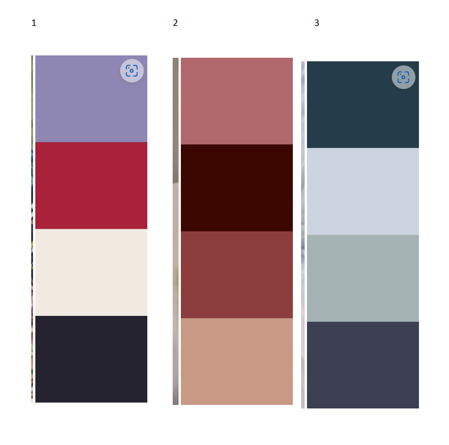

# PROJECT 3
# THE DIVORCE PARTY GUEST BOOK
# By Chewing the CRUD

## DESCRIPTION
A MERN Full-Stack Website that allows users to sign-up for an account, read, post, edit and delete comments in a Divorce Party Guest Book. This was implemented as a group project consisting of four General Assembly Software Engineering Immersive students with the amusing team name "Chewing the CRUD".  

## WHY A DIVORCE PARTY GUESTBOOK? 
Lots of people will attest to their experience of divorce as one of the best things that ever happened to them. Of course they will want to celebrate with lots of friends and family. What better way to commemorate the celebration than with a Divorce Party Guestbook? The app was developed to help recent divorcees enjoy their divorce party to the fullest and will hopefully let users re-live all the happy memories. A divorce isn't the end; merely the beginning to either a new chapter or a whole new sequel.

## DEPLOYMENT LINK

- [The Divorce Party Guest Book](https://hpramanathan.github.io/project3-mernstack-app/).
- GitHub Repository: https://github.com/hpramanathan/project3-mernstack-app

## BRIEF
A set of requirements were provided to the project team for the front-end, back-end (server), styling, formatting and deployment:

### MVP Requirements
  - **Planning**
    - Have a thoroughly documented Team Expectations Google document / markdown file.
    - Have a thoroughly developed, beautiful README.md file.
    - Take time for each team member to discuss where they feel strongest and weakest, in terms of coding ability.
    - Create a Excalidraw or Whimsical document to convey the data flow with component hierarchy included.

  - **Collaboration**
    - Contribute equally.
    - Have a solid understanding of the entire project. (Even the features implemented by other team members.)
    - Take time to pair program with teammates to reinforce learning.
    - Be prepared to explain sections of code that were written by teammates.
    
    **Client (Front End)**
    - Have a working, interactive React app, built using npx create-react-app client
    - Have at least 6 separate, rendered components in an organized and understandable React file structure.
    - Use only React for DOM Manipulation.
    - Consume data from your API, and render that data in your components.
    - Utilize React Router, for client-side routing.
    - Authentication!
    
    **Server (Back End)**
    - Have working generic router actions for CRUD using Express, Mongoose, and MongoDB.
    - Have at least 2 models (more if it makes sense)
    - Have full CRUD on at least one of your models
    - Be able to Add/Delete on any remaining models (if it makes sense)
    - Authentication!
    
    **Styling**
    - Be styled with CSS.
    - Use flexbox (display: flex) or CSS Grid.
    - Implement responsive design on 2 screen sizes (including desktop) using a media query (mobile).
    - You can use a CSS framework if you want to.
    
    **Linting**
    - Indent properly.
    - Utilise high-quality, semantic variable names and follow naming conventions.
    - Remove unnecessary boilerplate React files and code.
    - Remove all console.log()s and commented out code (functional notes/comments are okay).
    
    **Deployment**
    - Deploy the fully functional front-end via GitHub Pages or Vercel.
    - Deploy the back-end via Heroku (or vercel).
    - Deploy the MongoDB database on MongoDB Atlas.

## GETTING STARTED/CODE INSTALLATION

  - To begin with a GitHub Repository called **project3-mernstack-app** was set up that was cloned by all the team members. 
  - A number of packages needed to be installed in the code as dependencies in both the front-end and back-end directories. To make the process as neat as possible (and primarily to avoid GitHub merge conflicts) it was decided that one person would do the package installations relevant to their bit of coding and then everyone else would run a `git pull` command in their command-line interface (CLI) terminal. This would merge the *package-json* dependencies to everyone's code and then each member could run an `npm install` command in their own CLI terminal.  
  - We all used Visual Studio as a code editor. Initially, two team members (Franziska and Hari) tried to use VS Code's **Live Share** feature to programme as a pair, but confusion relating to merge conflicts resulted in its prompt abandonment.

## TIMEFRAME & WORKING TEAM

- We were given 8 days to work on this project and our team of 4 members comprised of:
  - Benjamin Khoury
  - Franziska Kissling
  - Hari Ramanathan (GitHub Code Owner/Team Lead)
  - Katie Loesch

## TECHNOLOGIES USED
- ### CODE VERSIONING/CONTROL

  - Git / GitHub
    - https://git-scm.com/
    - https://github.com/https://github.com/

- ### DEVELOPER TOOLS

  - Google Chrome and Google Chrome Developer Tools
    - https://www.google.com/intl/en_uk/chrome/
  - Mozilla Firefox and Mozilla Firefox Developer Tools
    - https://www.mozilla.org/en-GB/firefox/new/
  - Visual Studio Code
    - https://code.visualstudio.com/
  - Windows Subsystem for Linux
    - https://learn.microsoft.com/en-us/windows/wsl/install
  - Postman
    - https://www.postman.com/

- ### FRONT END

  - Netlify
    - https://www.netlify.com/
  - React Router
    - https://reactrouter.com/en/main
  - Tailwind CSS React
    - https://tailwindcss.com/docs/guides/create-react-app
  - bcyryptjs
    - https://www.npmjs.com/package/bcryptjs

- ### BACK END

  - Heroku
    - https://www.heroku.com/
  - MongoDB Atlas
    - https://www.mongodb.com/cloud/atlas/register
  - bcrypt
    - https://www.npmjs.com/package/bcrypt
  - CORS
    - https://www.npmjs.com/package/cors
  - dotenv
    - https://www.npmjs.com/package/dotenv
  - express
    - https://www.npmjs.com/package/express
  - jsonwebtoken
    - https://www.npmjs.com/package/jsonwebtoken
  - mongodb
    - https://www.npmjs.com/package/mongodb
  - mongoose
    - https://www.npmjs.com/package/mongoose
  - nodemon
    - https://www.npmjs.com/package/nodemon
  - passport
    - https://www.npmjs.com/package/passport
  - passport-jwt
    - https://www.npmjs.com/package/passport-jwt

- ### EXTERNAL WEB RESOURCES

  - Icons
    - All icons used are Scalable Vector Graphics from iconify
      - https://iconify.design/

- ### LAYOUT

Franziska took the lead with researching a number of colour schemes online and as a team we agreed upon the first colour scheme below:

Franziska did the same with potential images to be used for the website. Again, as a team we went with the first one. (**WARNING**: One of the images contains a swear word.)

We used the **Tailwind CSS** framework for our layout and styling. We added the chosen colour scheme above to our Tailwind *config* file.

- ### FLOW CHART, USER STORIES AND WIREFRAME

The design was done in a meeting with all the members of the team. 
User stories, wireframes, a schema containing the models and a flowchart were produced during this session. These were consolidated into a README document. 

[README](https://docs.google.com/document/d/1cIHDD5IY5U9jJfRezuFAYF1JMcIhAnN69uqpn7qwLw8/edit)

This was  were provided to the tutors who reviewed these and approved the project. 

## PLANNING

The team met for half a day to align on the project concept, a schedule and coding approach. 

Decisions were made around the team name "Chewing the Crud" and on what type of app would be built, the Divorce Party Comments Book. 

Areas like the team members' strengths and weaknesses and values were discussed. 
This was captured within a Team Expectations Document stored on the team's shared drive. It was later shared with the course tutors. 

[Team Expectations Setting Document](https://docs.google.com/document/d/1QG9nAynGNKvsSN4Jzfesn4T-DbXv5GxTEtXh-bZMAAM/edit)

## BUILD/CODE PROCESS

The project utilised the MERN Stack. As a first step a connection with the Mongo Database was established. A seed file was then produced to populate initial data into the database. 

Models were then established for the Users and Posts. Once the models were completed backend routes were coded. The routes were tested in Postman API Platform. 

After the backend routes were successfully tested the frontend routes were implemented.

The user authentication was developed using bcrypt for password hashing and Passport JWT for user authentication.  The authentication was integrated into the routes.

Github provided version control. To minimise merge conflicts commits and pulls were done frequently. 

## CHALLENGES

- Seeding
- Authentication

## WINS

- Authentication
- Tailwind CSS
- Git conflicts

## KEY LEARNING/TAKEAWAYS

- Ba Ba Black Sheep

## BUGS

- Not insects 😂😂

## FUTURE IMPROVEMENTS

- Create a file upload facility for user profile pictures and party pictures within a post. 
- Get quotes about divorce via an external API. 
