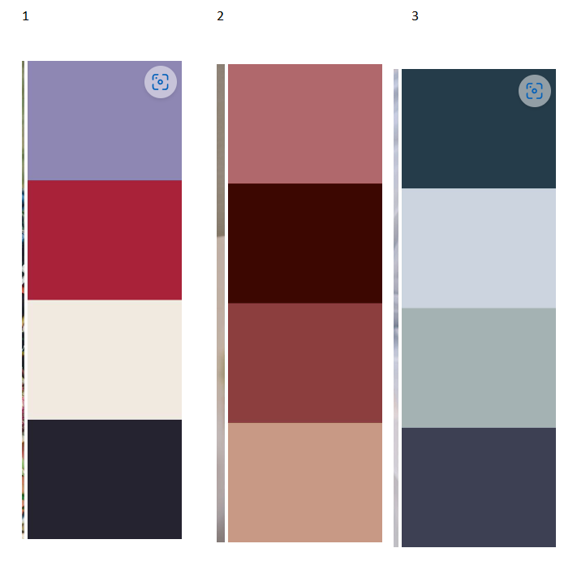

# PROJECT 3
# THE DIVORCE PARTY GUEST BOOK
# By Chewing the CRUD

## DESCRIPTION

<<<<<<< HEAD
- A MERN Full-Stack Website that allows users to sign-up and read, post, edit and delete comments in a Divorce Party Guest Book. This was implemented as a group project consisting of four General Assembly Students with the amusing team name "Chewing the CRUD". 

## WHY A DIVORCE PARTY GUESTBOOK? 

-Lots of people will experience their divorce as one of the best things that ever happened to them. Of course they
will want to celebrate with lots of friends and family. What better way to commemorate the celebration than with a Divorce Party Guestbook? The app was developed to help recent divorcees enjoy their divorce party to the fullest and will hopefully let users relive all the happy memories.
=======
## WHY A DIVORCE Party GUESTBOOK? 
- Lots of people will experience their divorce as one of the best things that ever happened to them. Of course they will want to celebrate with lots of friends and family. What better way to commemorate the celebration than with a Divorce Party Guestbook? 
>>>>>>> dev

## DEPLOYMENT LINK

- [The Divorce Party Guest Book](https://hpramanathan.github.io/project3-mernstack-app/).
- GitHub Repository: https://github.com/hpramanathan/project3-mernstack-app

## BRIEF

-A set of Requirements was provided to the project team for the front-end, back-end and layout. These are captured here: 

[MVP](https://docs.google.com/document/d/11-8h-0BhooCWmEsl-5tARRfb_azYPBD5/edit)

## GETTING STARTED/CODE INSTALLATION

-To begin with a GitHub Repository was set up with was cloned by the team members. 
-A number of packages needed to be installed in the code as dependencies. To make the process as neat as possible it was decided that one person do the installations and the others do a git pull running a subsequent npm install.  
-Visual Studio was utilised as a code editor. 

## TIMEFRAME & WORKING TEAM

- The team of four members was provided with a timeframe of eight days to work on this project. 

-Team members are:

  - Benjamin Khoury
  - Franziska Kissling
  - Hari Ramanathan
  - Katie Loesch

  Hari Ramanathan took on the role of the GitHub Coordinator and the Project Manager. 

## TECHNOLOGIES USED
- ### CODE VERSIONING/CONTROL

  - Git / GitHub
    - https://git-scm.com/
    - https://github.com/https://github.com/

- ### DEVELOPER TOOLS

  - Google Chrome and Google Chrome Developer Tools
    - https://www.google.com/intl/en_uk/chrome/
  - Mozilla Firefox and Mozilla Firefox Developer Tools
    - https://www.mozilla.org/en-GB/firefox/new/
  - Visual Studio Code
    - https://code.visualstudio.com/
  - Windows Subsystem for Linux
    - https://learn.microsoft.com/en-us/windows/wsl/install
  - Postman
    - https://www.postman.com/

- ### FRONT END

  - Netlify
    - https://www.netlify.com/
  - React Router
    - https://reactrouter.com/en/main
  - Tailwind CSS React
    - https://tailwindcss.com/docs/guides/create-react-app
  - bcyryptjs
    - https://www.npmjs.com/package/bcryptjs

- ### BACK END

  - Heroku
    - https://www.heroku.com/
  - MongoDB Atlas
    - https://www.mongodb.com/cloud/atlas/register
  - bcrypt
    - https://www.npmjs.com/package/bcrypt
  - CORS
    - https://www.npmjs.com/package/cors
  - dotenv
    - https://www.npmjs.com/package/dotenv
  - express
    - https://www.npmjs.com/package/express
  - jsonwebtoken
    - https://www.npmjs.com/package/jsonwebtoken
  - mongodb
    - https://www.npmjs.com/package/mongodb
  - mongoose
    - https://www.npmjs.com/package/mongoose
  - nodemon
    - https://www.npmjs.com/package/nodemon
  - passport
    - https://www.npmjs.com/package/passport
  - passport-jwt
    - https://www.npmjs.com/package/passport-jwt

- ### EXTERNAL WEB RESOURCES

  - icons
    - all icons used are Scalable Vector Graphics from iconify
    - https://iconify.design/

- ### LAYOUT

-A number of colour schemes were found online and shared with the team for alignment on which one to use. It was agreed to go with the first colour scheme. 

-Potential images were then provided to the group for decisioning. Warning: One of the images contains a word that could be be considered rude. 

-As none of the team members had a particular preference the first image was utilised. 

-The Tailwind Framework was used for the layout with the selected colour scheme customised within Tailwind. 

-Image of the Layout

- ### FLOW CHART, USER STORIES AND WIREFRAME

The design was done in a meeting with all the members of the team present. 
User stories, wireframes, a schema containing the models and a flowchart were produced during this session. These were consolidated into a README document. Please note that this is a Google Drive Document which may need access granted to view this. 

[README](https://docs.google.com/document/d/1cIHDD5IY5U9jJfRezuFAYF1JMcIhAnN69uqpn7qwLw8/edit)

This was  were provided to the tutors who reviewed these and approved the project. 

## PLANNING

The team met for half a day to align on the project concept, a schedule and coding approach. 

Decisions were made around the team name "Chewing the Crud" and on what type of app would be built, the Divorce Party Comments Book. 

Areas like the team members' strengths and weaknesses and values were discussed. 
This was captured within a Team Expectations Document stored on the team's shared drive. It was later shared with the course tutors. 

[Team Expectations Setting Document](https://docs.google.com/document/d/1QG9nAynGNKvsSN4Jzfesn4T-DbXv5GxTEtXh-bZMAAM/edit)

## BUILD/CODE PROCESS

The project utilised the MERN Stack. As a first step a connection with the Mongo Database was established. A seed file was then produced to populate initial data into the database. 

Models were then established for the Users and Posts. 

Once the models were completed backend routes were coded. The routes were tested in Postman API Platform. 

After the backend routes were successfully tested the frontend routes were implemented.

The user authentication was developed using bcrypt for password hashing and Passport JWT for user authentication.  The authentication was integrated into the routes.

Github provided version control. To minimise merge conflicts commits and pulls were done frequently. 

## CHALLENGES

- Authentication was one of the biggest challenges given its complexity. To solve the challenge extensive research was done by multiple team members. The authentication took a few days to implement. 
-GIT was a challenge with merge conflicts, limited experience of using GIT within the team. As the team members got used to GIT the process started to run more smoothly. 

## WINS

- As mentioned above, the authentication was the most complex and time-consuming piece to implement. As this could be developed successfully it is considered to be a key win for the project. 
- Tailwind CSS was new to the team members who managed to learn and apply this layout framework.
- Most team members hadn't used GIT on a project before. Towards the end of the project the team felt a lot more comfortable with GIT. 
With GIT being a key skill in the work place this was a good win to have. 

## KEY LEARNING/TAKEAWAYS

- An interesting learning was that with node.js not being sequential that error handling can be carried out before the preceding code is processed. A solution to this was to use async functions. 
- One of the team members wasn't able to uses the localhost:3000 with npm start for React. A resolution was found by upgrading WSL. 
-On occasions the port was amended in the server.js file. This prevented other team members from being able to use the site and from APIs running. It was aligned to only make updates to the port with agreement from all the team members. 

## BUGS

- At the time of writing the team isn't aware of any bugs. However, as with most projects a number of bugs were found during development such as a new post being updated many times or users being able to login wiht any credentials. These have now been fixed. 

## FUTURE IMPROVEMENTS

- Create a file upload facility for user profile pictures and party pictures within a post. 
- Get quotes about divorce via an external API. 
-Allow a user to generate a customised Divorce Party Guestbook so that multiple users could have their Divorce Party Guestbook on the site. 
